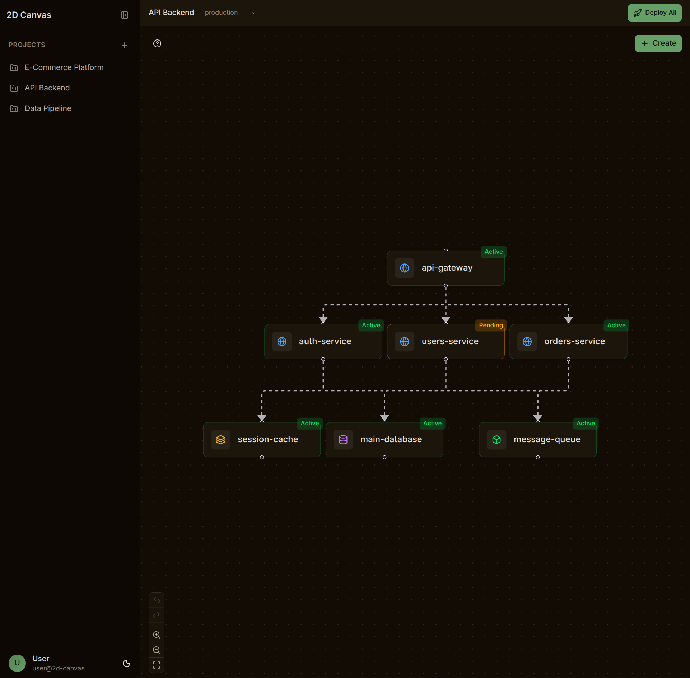

# 2D Canvas

2D Canvas is a visual infrastructure orchestration tool inspired by [Railway's](https://railway.app) dashboard. It lets you drag-and-drop infrastructure components onto a 2D canvas, connect them to define dependencies, and simulate deployments with animated status updates.

A hosted version is available at [https://2dcanvas.chiragvijay.com](https://2dcanvaschiragvijay.com).



## Core Features

- **Drag-and-Drop Canvas**: Place infrastructure components (web services, databases, caches, queues, cron jobs, storage) onto an interactive 2D canvas powered by React Flow.
- **Dependency Mapping**: Draw connections between nodes to define service dependencies and visualize your infrastructure topology.
- **Deployment Simulation**: Watch animated deployment status updates propagate through your infrastructure graph with success/failure states per node.
- **Multi-Project Support**: Manage multiple projects with environment switching (production/staging/development) and localStorage persistence.
- **Undo/Redo**: Full history support with keyboard shortcuts and toolbar controls.
- **Customizable Themes**: Support for Light and Dark themes.

### This project was built using:

- **React + TypeScript**: Latest React and full type safety.
- **@xyflow/react (React Flow v12)**: Library for building node-based editors and interactive diagrams.
- **TanStack Router**: File-based routing.
- **Tailwind CSS 4**: Utility-first styling with OKLCH color support.
- **Radix UI**: Accessible, unstyled primitives for dialogs, dropdowns, and more.
- **Vite**: Fast HMR and ESM-first build tooling.

### Getting Started

To run the project locally:

1. Install [Bun](https://bun.sh).
2. Clone the repository.
3. Install dependencies:
   ```bash
   bun install
   ```
4. Start the development server:
   ```bash
   bun run dev
   ```
5. Open `http://localhost:3000` in your browser.

### Building For Production

```bash
bun run build
```
